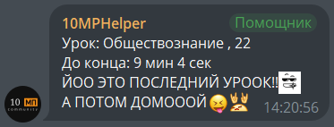
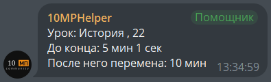
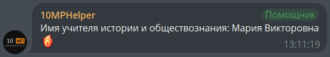
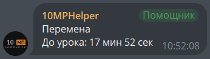

[](https://github.com/mymmrac/telego)


# CMHTG — Classmates Helper Telegram Bot

Исходники бота для Telegram, который помогает классу следить за расписанием уроков: показывает картинку расписания на сегодня/ближайший день, статус "идёт урок / идёт перемена" в реальном времени, а также умеет искать ФИО учителей и пересылать анонимные сообщения.

## Возможности
- Расписание уроков
    - Красивая карточка-картинка с подсветкой текущего урока
    - Показ на сегодня или на ближайший день, где уроки ещё не закончились
    - Разделение по подгруппам (ИТ / СЭ) — каждый видит только свои предметы
    - Редактирование расписания прямо из чата (`/set`, `/delDay`)
- Статус урока/перемены в реальном времени ("сколько осталось", "когда следующая перемена")
- Поиск ФИО учителя по названию предмета (`/name`, "имя", "учитель")
- Анонимная пересылка сообщений в отдельную тему супергруппы
- Набор шуточных текстовых триггеров ("убить", "обнять", "67" и т.д.) с кастомными эмодзи
- Режим сбора ID кастомных эмодзи (для наполнения списка выше), включается отдельным флагом

## Установка

```bash
git clone git@github.com:Alka-devel/CMHTG.git
cd CMHTG
go build
```

## Использование
Прямо из папки с проектом:
```bash
go run . -token {botTokenFromBotFather}
```

Реагирует на команды и текстовые триггеры
- `/start` — приветствие и выбор подгруппы (ИТ / СЭ)
- `/schedule`, "расписание" — показать расписание (с подтверждением); "…ближайшее" сразу ищет ближайший незакончившийся день
- `/interruption`, "перемена" — текущий статус урока/перемены
- `/set <текст>` — сохранить расписание на день (формат см. ниже)
- `/delDay <ДД.ММ.ГГ>` — удалить день из сохранённого расписания
- `/name <предмет>`, "имя", "учитель" — ФИО учителя по предмету
- `/change`, "поменять группу", "группа" — сменить подгруппу ИТ/СЭ
- `/anonmsg` (ответом на сообщение) — переслать анонимно в отдельную тему группы

### Формат расписания для `/set`
Первая строка — дата в формате `ДД.ММ.ГГ`, далее по одной строке на урок:
```
07.09.26
1|Алгебра|204
2|Русский язык(и.т.)|118
3|Информатика(с.э.)|305
```
Пометки `(и.т.)` / `(с.э.)` привязывают урок к конкретной подгруппе.

## Аргументы и флаги

```
Usage: cmhtg [flags]

Flags:
  --token string         токен бота от BotFather
  --table-path string    путь до файла с расписанием (default "schedule.json")
  --emojiEnabled bool    включить режим сбора ID кастомных эмодзи (default false)
  -h, --help             показать справку
```

Пример запуска с сохранением расписания в отдельный файл:
```bash
go run . --token 123:ABC --table-path data/schedule.json
```

## Скриншоты

**Пример 1:**



**Пример 2:**



**Пример 3:**



**Пример 4:**



## Требования

- Go 1.27.0+

## Зависимости

Внешних утилит не требуется — весь рендер расписания идёт средствами Go:

| Компонент | Назначение |
|-----------|------------|
| [telego](https://github.com/mymmrac/telego) | взаимодействие с Telegram Bot API |
| [fogleman/gg](https://github.com/fogleman/gg) | отрисовка карточки расписания на 2D-канвасе |
| [golang.org/x/image](https://pkg.go.dev/golang.org/x/image) | рендер шрифтов (OpenType) |
| `assets/Roboto-Regular.ttf`, `assets/Roboto-Medium.ttf` | шрифты, вшиваются в бинарник через `go:embed` |

## Лицензия

MIT — см. [LICENSE](LICENSE)