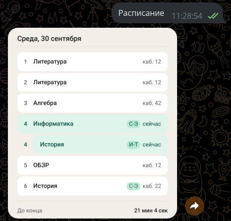
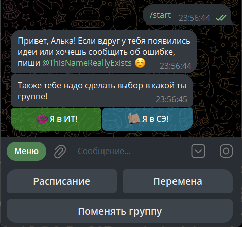
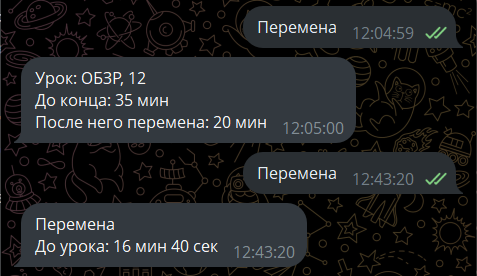
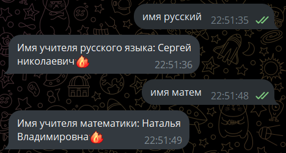
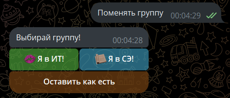
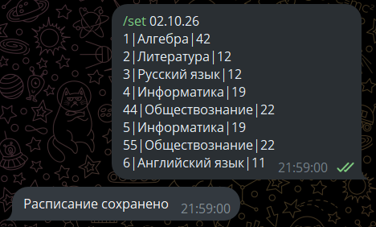

[](https://github.com/mymmrac/telego)


# CMHTG — Classmates Helper Telegram Bot

Telegram-бот для класса: рисует карточку с расписанием, в реальном времени говорит, что сейчас — урок или перемена, присылает решения из ГДЗ, ищет учителей и определения терминов, а ещё умеет пересылать анонимные сообщения.

<!-- СКРИНШОТ: главная картинка — карточка расписания с подсвеченным текущим уроком («сейчас»), ЛС, выбрана подгруппа ИТ -->


## Содержание

- [Возможности](#возможности)
- [Быстрый старт](#быстрый-старт)
- [Команды](#команды)
- [Формат расписания для `/set`](#формат-расписания-для-set)
- [Звонки и статус урока](#звонки-и-статус-урока)
- [Настройка под свой класс](#настройка-под-свой-класс)
- [Флаги](#флаги)
- [Структура проекта](#структура-проекта)
- [Тесты](#тесты)
- [Зависимости](#зависимости)
- [Лицензия](#лицензия)

## Возможности

**Расписание**
- Карточка-картинка в высоком разрешении (рендер ×3) с подсветкой текущего урока и временем до конца
- Расписание на сегодня, на конкретную дату или на ближайший день, где уроки ещё не закончились
- Подгруппы ИТ / СЭ: в личке каждый видит только свои предметы, в общем виде уроки помечаются метками «И-Т» / «С-Э»
- Дополнительные строки к уроку (несколько предметов в один слот)
- Редактирование прямо из чата: `/set`, `/delDay`
- Расписание хранится в `schedule.json`, выбор подгрупп — в `classmates.json`

**Статус урока / перемены**
- Что идёт сейчас, сколько осталось, какая перемена будет после урока
- Отдельные расписания звонков для понедельника и остальных дней
- Учитывает, сколько уроков реально стоит в этот день, — после последнего бот сообщает, что уроков нет

**Прочее**
- Поиск ФИО учителя по названию предмета
- Поиск определения термина (`/term`)
- Анонимная пересылка сообщений в отдельную тему супергруппы
- Шуточные RP-реакции («обнять», «убить», «67» и т.д.) — включаются флагом `--rp-coms`
- Режим сбора ID кастомных эмодзи — включается флагом `--emojiEnabled`



## Быстрый старт

### Требования

- Go 1.27.0+
- Google Chrome / Chromium — нужен для `/term` (библиотека `ruwiki-term` запускает браузер через chromedp)
- Токен бота от [@BotFather](https://t.me/BotFather)

### Установка

```bash
git clone git@github.com:Alka-devel/CMHTG.git
cd CMHTG
go build
```

### Запуск

```bash
go run . -token {botTokenFromBotFather}
```

Или с отдельными файлами данных и RP-режимом:

```bash
go run . --token 123:ABC --table-path data/schedule.json --clsmts-table-path data/classmates.json --rp-coms
```

### Настройка бота в BotFather

- Отключите **Group Privacy** (`/setprivacy` → Disable): бот реагирует и на обычные слова («расписание», «перемена», «имя …»), а не только на команды.
- По желанию задайте список команд через `/setcommands`:

```
schedule - расписание
interruption - урок или перемена
name - ФИО учителя по предмету
gdz - решение из ГДЗ
term - значение термина
change - сменить подгруппу
```

## Команды

Бот понимает и команды, и обычные слова — регистр не важен там, где указано «в любом регистре».

| Команда | Текстовые триггеры | Что делает |
|---|---|---|
| `/start` | — | Приветствие, нижняя клавиатура, предложение выбрать подгруппу |
| `/schedule` | «расписание» | Спрашивает подтверждение и показывает расписание на сегодня |
| `/schedule ближайшее` | «расписание ближайшее» | Сразу показывает ближайший незакончившийся день (ищет до 14 дней вперёд) |
| `/schedule ДД.ММ.ГГ` | «расписание ДД.ММ.ГГ» | Расписание на указанную дату |
| `/interruption` | «перемена» (в любом месте сообщения) | Статус: урок или перемена, сколько осталось |
| `/change` | «поменять группу», «группа» | Сменить подгруппу ИТ / СЭ (только в личке) |
| `/name <предмет>` | «имя …», «учитель …» | ФИО учителя по предмету |
| `/term <слово>` | «значение …», «термин …» | Определение термина. Только в личке — в группах сообщение удаляется. Берётся одно слово |
| `/set <расписание>` | — | Сохранить расписание на день, см. [формат](#формат-расписания-для-set) |
| `/delDay <ДД.ММ.ГГ>` | — | Удалить день из сохранённого расписания |
| `/anonmsg <текст>` | — | Переслать сообщение анонимно в отдельную тему группы |
| `/clean` | «очистка» | Удалить сообщения бота в чате. Доступно только владельцу (ID зашит в коде) |

Если группа ещё не выбрана, в личке `/schedule` сначала предложит её выбрать.

<!-- СКРИНШОТ: /interruption — два сообщения рядом: во время урока (с «после него перемена») и во время перемены -->


<!-- СКРИНШОТ: /name математика (или «имя физика») — ответ с ФИО -->


### Подгруппы

В личных сообщениях бот запоминает подгруппу пользователя и рисует только его предметы. Уроки, помеченные другой подгруппой, скрываются. Без выбранной подгруппы (например, в общем чате) показываются все уроки, а предметы подгрупп отмечаются метками «И-Т» и «С-Э».

<!-- СКРИНШОТ: один и тот же день в двух вариантах — со всеми предметами и метками И-Т / С-Э (слева) и только для подгруппы ИТ (справа) -->


## Формат расписания для `/set`

Дата в формате `ДД.ММ.ГГ` пишется **в той же строке**, что и команда `/set`. Дальше — по одной строке на урок в формате `номер|предмет|кабинет`:

```
/set 07.09.26
1|Алгебра|204
2|Русский язык(и.т.)|118
3|Информатика(с.э.)|305
```

- Пометки `(и.т.)` / `(с.э.)` в названии привязывают урок к подгруппе. Сама пометка в названии не показывается.
- **Дополнительные строки к уроку:** двузначный номер, где обе цифры — номер урока. Например, `22|Информатика(и.т.)|305` — дополнительная строка ко 2-му уроку; в общем виде она рисуется со сдвигом под основным уроком.
- Повторная отправка `/set` с той же датой заменяет день целиком.
- Удалить день: `/delDay 07.09.26`.

<!-- СКРИНШОТ: отправка /set с многострочным расписанием и ответ бота «Расписание сохранено» -->


## Звонки и статус урока

Время звонков задаётся в `config.go`.

| Урок | Понедельник | Вт–Сб |
|---|---|---|
| 1 | 8:30 – 9:10 | 8:30 – 9:10 |
| 2 | 9:15 – 9:55 | 9:20 – 10:00 |
| 3 | 10:05 – 10:45 | 10:10 – 10:50 |
| 4 | 11:05 – 11:45 | 11:10 – 11:50 |
| 5 | 11:55 – 12:35 | 12:00 – 12:40 |
| 6 | 12:55 – 13:35 | 13:00 – 13:40 |
| 7 | 13:45 – 14:25 | 13:50 – 14:30 |

Статус считается по сохранённому расписанию на сегодня: если в дне только 5 уроков, после пятого бот скажет, что уроков нет. В воскресенье (и в субботу после уроков) бот желает отдыхать.

## Настройка под свой класс

Часть настроек пока зашита в код:

| Что | Где |
|---|---|
| Время звонков | `config.go` |
| Список учителей и слова-алиасы предметов | `teacherLookup` в `main.go` |
| Чат и тема для `/anonmsg` | `anonmsgCom(bh, 138)` и ID чата внутри функции, `main.go` |
| Владелец для `/clean` | ID пользователя в `VACUUUUMCLEANEER`, `main.go` |
| RP-реакции | `irisReactions` в `rp.go` |
| Названия подгрупп | `group.go` |

## Флаги

```
Usage: cmhtg [flags]

Flags:
  --token string              токен бота от BotFather
  --table-path string         путь до файла с расписанием (default "schedule.json")
  --clsmts-table-path string  путь до файла с подгруппами пользователей (default "classmates.json")
  --rp-coms bool              включить RP-реакции и «пинг» (default false)
  --emojiEnabled bool         включить режим сбора ID кастомных эмодзи (default false)
  -h, --help                  показать справку
```

Файлы `schedule.json` и `classmates.json` создаются при первом сохранении; `*.json` добавлен в `.gitignore`, так что данные в репозиторий не попадут.

### Режим сбора эмодзи

С `--emojiEnabled` бот отвечает ID каждого кастомного эмодзи из сообщения, в котором есть слово «emoji» / «эмоджи» / «емоджи». Нужен, чтобы наполнять списки эмодзи в коде.

### RP-режим

С `--rp-coms` бот отвечает на сообщения-реакции (например «обнять» в ответ на чужое сообщение → «Имя обнял Имя»; у администраторов подставляется их custom title) и на «пинг».

<!-- СКРИНШОТ (необязательно): RP-реакция в групповом чате -->


## Структура проекта

| Файл | Назначение |
|---|---|
| `main.go` | запуск, флаги, регистрация обработчиков, команды `/set`, `/delDay`, `/name`, `/schedule`, `/term`, `/anonmsg`, `/clean` и др. |
| `callback.go` | обработка inline-кнопок, отправка карточки расписания |
| `schedule.go` | модель расписания, парсинг `/set`, сохранение, статус урока/перемены |
| `schedule_image.go` | отрисовка карточки на 2D-канвасе (`gg`) |
| `config.go` | расписание звонков |
| `group.go` | подгруппы ИТ / СЭ и их хранение |
| `rp.go` | RP-реакции и «пинг» |
| `waiter.go` | ожидание следующего сообщения от чата |
| `assets/` | шрифты Roboto (вшиваются через `go:embed`) и скриншоты |

## Тесты

```bash
go test ./...
```

Часть тестов — не автоматические проверки, а способ посмотреть результат глазами:

| Тест | Что делает |
|---|---|
| `TestStatusManual` | печатает статус урока/перемены для набора моментов времени (понедельник и вторник) |
| `TestRenderSchedulePreview` | рисует расписание на сегодня в `preview.png` (нужен сохранённый день в `schedule.json`) |

```bash
go test -run TestStatusManual -v
go test -run TestRenderSchedulePreview -v
```

## Зависимости

Весь рендер расписания идёт средствами Go, внешних утилит для него не требуется. Исключение — `/term`: ему нужен Chrome / Chromium.

| Компонент | Назначение |
|-----------|------------|
| [telego](https://github.com/mymmrac/telego) | взаимодействие с Telegram Bot API |
| [fogleman/gg](https://github.com/fogleman/gg) | отрисовка карточки расписания на 2D-канвасе |
| [golang.org/x/image](https://pkg.go.dev/golang.org/x/image) | рендер шрифтов (OpenType) |
| [goquery](https://github.com/PuerkitoBio/goquery) | разбор HTML-страниц |
| [ruwiki-term](https://github.com/Alka-devel/ruwiki-term) | поиск определений терминов (через chromedp) |
| `assets/Roboto-Regular.ttf`, `assets/Roboto-Medium.ttf` | шрифты, вшиваются в бинарник через `go:embed` |

## Лицензия

MIT — см. [LICENSE](LICENSE)
